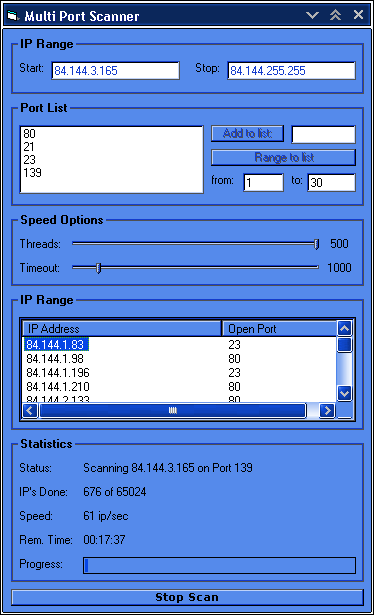



## Multiple Thread/IP/Port Scanner

### Description

This is an example of a Winsock-Portscanner which scans a List of Ports.

You can set the Thread Number and the Timeout.

It is very fast.

Please vote if you like it!
 
### More Info
 

             |
---                |---
**Submitted On**   |2006-02-11 11:00:02
**By**             |[GaveDigga](https://github.com/Planet-Source-Code/PSCIndex/blob/master/ByAuthor/gavedigga.md)
**Level**          |Beginner
**User Rating**    |4.3 (13 globes from 3 users)
**Compatibility**  |VB 3\.0, VB 4\.0 \(16\-bit\), VB 4\.0 \(32\-bit\), VB 5\.0, VB 6\.0
**Category**       |[Internet/ HTML](https://github.com/Planet-Source-Code/PSCIndex/blob/master/ByCategory/internet-html__1-34.md)
**World**          |[Visual Basic](https://github.com/Planet-Source-Code/PSCIndex/blob/master/ByWorld/visual-basic.md)
**Archive File**   |[Multiple\_T1972252112006\.zip](https://github.com/Planet-Source-Code/gavedigga-multiple-thread-ip-port-scanner__1-64292/archive/master.zip)

